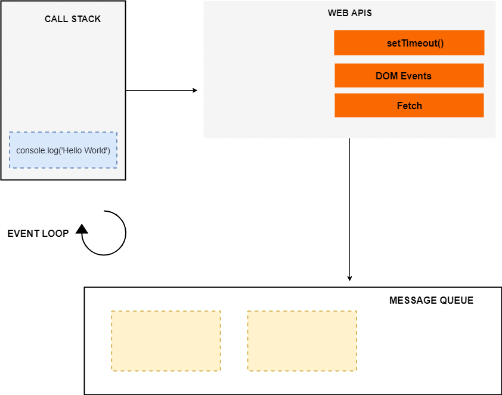

# Asynchronous JavaScript 
References: 
[1](https://blog.bitsrc.io/understanding-asynchronous-javascript-the-event-loop-74cd408419ff)
[2](https://medium.com/@sudhakarsp06/creation-phase-and-execution-phase-in-javascript-32fcdbef60f4)

[Back](../README.md)
<p></p><p></p>


### Facts:

- Javascript Is A Single-threaded Programming Language
    - only one thing can happen at a time.
    - you don’t have to worry about the concurrency issues.
    - you can't perform long operations such as network access without blocking the main thread.

- Using asynchronous JavaScript, you can perform long network requests without blocking the main thread.
    - callbacks
    - promises
    - async/await


### Phases
> When a global code / function / eval is executed it goes through 2 phases.
> 1. Creation Phase
> 2. Execution Phase

#### A. Creation Phase
Compiler runs through the entire code for 2 time before actually executing the code
1. In the first run, It picks all function declarations and stores them in memory with their reference.
2. In the second run, It picks all variables and assign undefined to them. In the event of a conflict between variable and function declaration name then that variable is ignored.

#### B. Execution Phase
1. Variables assigned with values
2. Functions executed

### Execution Context
> An Execution Context is an abstract concept of an environment where the JavaScript code is evaluated and executed. 
> Whenever any code is run in JavaScript, it’s run inside an execution context.

- The function code executes inside the function execution context, and the global code executes inside the global execution context. Each function has its own execution context.
- Each execution context creates a Variable Object which consists of three things:
    - Local Variable Object
    - Scope Chain
    - `this`


### Call Stack
> A stack which is used to store all the execution context created during the code execution.

- JavaScript has a single call stack because it’s a single-threaded programming language.
- The call stack has a LIFO structure (Last In, First Out) which means that the items can be added or removed from the top of the stack only.


### Asynchronous JS Elements
- Call Stack
- Web APIs (setTimeout, DOM Events, Fetch, Service Worker API, ...) [#](https://developer.mozilla.org/en-US/docs/Web/API)
- Message Queue OR ES6 Job Queue/ Micro-Task Queue
    - ES6 introduced the concept of job queue/micro-task queue which is used by Promises in JavaScript. 
    The difference between the message queue and the job queue is that the job queue has a higher priority than the message queue, which means that promise jobs inside the job queue/ micro-task queue will be executed before the callbacks inside the message queue.
- Event Loop
    - The job of the Event loop is to look into the call stack and determine if the call stack is empty or not. 
    If the call stack is empty, it looks into the message queue to see if there’s any pending callback waiting to be executed.

> The event loop, the web APIs and the message queue/task queue are not part of the JavaScript engine, 
> it’s a part of browser’s JavaScript runtime environment or Nodejs JavaScript runtime environment

```ecmascript 6
const networkRequest = () => {
  setTimeout(() => {
    console.log('Async Code');
  }, 2000);
};
console.log('Hello World');
networkRequest();
console.log('The End');
```


